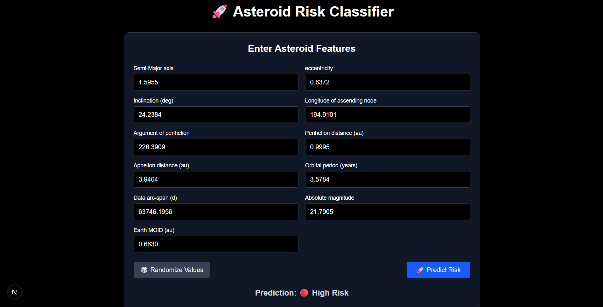

# Asteroid Risk Classifier

This project implements a full-stack machine learning system for predicting asteroid diameters and classifying near-Earth objects (NEOs) by potential risk based on NASA orbital data.

It includes:
- A regression pipeline for estimating asteroid diameters
- A classification system for assessing risk levels (low, medium, high)
- A deployed frontend for real-time user input and prediction

---



## Features

- **ML Pipeline:** Trained multiple regression and classification models on orbital datasets; Decision Tree Regressor achieved 97% test accuracy.
- **Risk Profiling:** Combines physical and orbital features to classify NEOs into 3 risk categories using a Random Forest Classifier.
- **Web Interface:** Interactive frontend built with Next.js and TypeScript for user-friendly input and prediction.
- **API Integration:** Flask backend exposes a `/predict` endpoint for real-time inference with preprocessing and scaling.
- **Feature Engineering:** Extracted and transformed over 10 orbital parameters including semi-major axis, eccentricity, albedo, and Earth MOID.

---

## Tech Stack

### Machine Learning
- scikit-learn
- pandas, numpy
- joblib

### Backend
- Python 3.x
- Flask
- Flask-CORS

### Frontend
- Next.js (App Router)
- TypeScript
- Tailwind CSS

---

## Project Structure
├── api.py # Flask backend API
├── asteroid_diameter_prediction.ipynb # Training and EDA notebook
├── frontend/ # Next.js frontend
│ ├── src/app # App Router pages
│ └── src/components # Input form and logic
├── neo_model.pkl # Trained model (excluded from repo)
├── scaler.pkl, imputer.pkl # Preprocessing artifacts
├── requirements.txt # Python dependencies
└── .gitignore


---

## Setup & Usage

### Backend (Flask API), Frontend (Next.js)

```bash
pip install -r requirements.txt
python api.py

cd frontend
npm install
npm run dev
